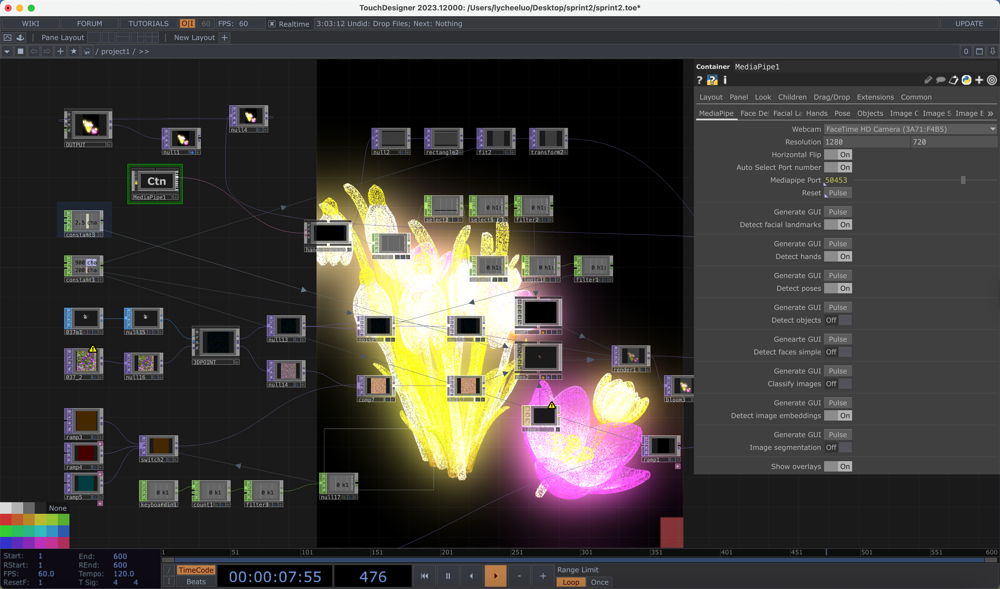

# Sprint 2: Disturbed Terrarium

### Team Information

Group members:

- Tian Xu (田旭)
- Yang Jiaqi (杨佳其)
- Ying Luo (罗颖)

My name is Ying Luo. My main contributions were developing the concept, designing the interaction logic, testing TouchDesigner and MediaPipe, making and simplifying the plant model, and organising the documentation.

### Project Overview

*Disturbed Terrarium* is an interactive digital ecosystem made in TouchDesigner. The built-in camera tracks the participant's hand through a MediaPipe component. The hand-position data changes the movement and spread of point-cloud plant forms.

The project is connected to **More-than-human Design**. The hand is not treated as a controller giving direct commands. Instead, it becomes a disturbance inside an ecosystem. A small movement can affect the whole plant group and cause it to separate, spread, or reorganise. This shows how human actions can create wider changes inside a connected natural system.

### Interaction

The participant places a hand in front of the camera. MediaPipe detects the hand landmarks inside TouchDesigner. I select and filter the hand-position channels, then use the values to control the point-cloud plants.

When there is little movement, the plants stay close together and their forms are still recognisable. When the participant moves their hand, the particles spread across the environment. When the disturbance ends, the system can move towards a calmer state again.

```text
Camera
-> MediaPipe hand tracking
-> selected and filtered CHOP channels
-> point-cloud plant movement
-> Render TOP and Bloom TOP
```

### Technical Details

The project uses a laptop, built-in camera, display screen, TouchDesigner, a MediaPipe component, CHOP and TOP processing, and an imported OBJ model.

I created the original plant model myself. I spent a long time developing the form, but the first version had too many surfaces and was too heavy for real-time use. I reduced many surfaces and simplified the geometry while trying to keep its organic appearance. Inside TouchDesigner, I developed the model into a point-based structure.

The blue **File SOP** imports the plant model. The purple **Movie File In TOP** imports its texture. If the texture node shows a yellow warning symbol, its file path needs to be relocated to the PNG file in the same project folder.

[TouchDesigner project](./sprint2_touchdesigner/sprint2.toe)  
[Plant model](./sprint2_touchdesigner/disturbed_terrarium_plant.obj)  
[Plant texture](./sprint2_touchdesigner/disturbed_terrarium_texture.png)

The `.toe` file is about 172 MB, so I used Git LFS to upload it.

### In-class TouchDesigner Practice

For the first classroom test, I created three elongated Sphere SOPs inside Geometry COMPs. I added a material, camera, light, and Render TOP. I then used a Keyboard In CHOP, Lag CHOP, and Null CHOP to control the X positions of the forms.

Pressing the A key changed the input value from 0 to 1 and made the forms separate. Releasing the key brought them back together. The Lag CHOP made the movement smoother. This helped me understand how input data can control visual movement. Later, I replaced the keyboard input with MediaPipe hand-tracking data.

### Tutorial Practice

I studied TouchDesigner techniques for geometry modulation, point-cloud processing, noise-based movement, filtering, colour, and Bloom effects. I adapted these techniques into my own plant system instead of only copying a tutorial.

The main purpose was to make the movement feel less mechanical. Noise, smoothing, different movement speeds, and small differences between the plants can make the ecosystem feel more natural.

### Media

The first screenshot shows the calm state. The yellow and pink point-cloud plants remain grouped and recognisable.



[Calm state screenshot](./media/photos/interaction-state-1-calm.png)

The second screenshot shows the disturbed state. Hand movement causes the point-cloud plants to spread and reorganise.


[Disturbed state screenshot](./media/photos/interaction-state-2-disturbed.png)

These setup photos show the laptop, built-in camera, hand gestures, and the TouchDesigner system running in real time.


[Open-hand setup photo](./media/photos/setup-open-hand.png)


[Pinch-gesture setup photo](./media/photos/setup-pinch-gesture.png)


[Dispersed-response setup photo](./media/photos/setup-dispersed-response.png)

The demo video shows the hand-tracking interaction and the change between the grouped and dispersed states.

[Demo video](./media/disturbed-terrarium-demo.mp4)

### Problems and Solutions

At the beginning, the interaction felt like a simple control system. We changed the concept so that the hand gesture represents an ecological disturbance rather than a direct command.

Our first technical plan used Python, MediaPipe, and OSC. MediaPipe did not support the Anaconda Python 3.13 environment, so we created a Python 3.10 environment and installed MediaPipe, OpenCV, and `python-osc`. We also tested the OSC address, port, and UDP settings. In the final version, we used a MediaPipe component directly inside TouchDesigner, which made the connection simpler.

The hand-tracking data sometimes changed too quickly and made the plants jump. I selected clearer channels and used filtering and smoothing before connecting the data to movement.

The movement also looked too mechanical at first. I adjusted the speed, distance, timing, noise, and group behaviour. The original plant model was also too complex, so I reduced its surfaces and converted it into point-based forms to improve performance.

### Process Reflection

The main challenge was connecting hand tracking to the TouchDesigner visual system. Our first idea was to use Python, MediaPipe, and OSC. This helped us understand the full technical path, but it also created compatibility and connection problems. MediaPipe did not work with the Anaconda Python 3.13 environment, so we created a Python 3.10 environment and installed the libraries again. We also learned that the OSC IP address, port, UDP protocol, and TouchDesigner settings all needed to match.

In the final prototype, I used a MediaPipe component directly inside TouchDesigner. This kept the camera input, hand landmarks, and visual network in one project. I still needed to test which hand channels were useful and how to filter unstable values. I worked in small stages by checking the camera, testing hand detection, selecting channels, smoothing the data, and then connecting it to the plants.

The keyboard exercise from class gave me a useful starting point. It showed me that an input value could be separated from the visual system. I first used a value from 0 to 1 to move simple forms, then replaced that value with MediaPipe hand data. The Lag CHOP also showed me why smoothing is important.

Making the plant model was another major part of the process. I spent a long time building its form, but the original model contained too many surfaces. It was difficult to use efficiently in a real-time system. I repeatedly simplified the geometry while trying to keep the plant's character. Turning it into a point-based structure helped the project run more effectively and also created the visual style of the final work.

The project also made me think differently about interaction. If the plants respond too directly, the work looks like a normal control tool. I wanted the hand movement to feel like a disturbance spreading through a connected environment. The calm and disturbed states helped communicate this idea. I learned that motion sensing is not only a technical input. It can also express ecological relationships, fragility, interdependence, and the consequences of human action.

In the future, I would improve the stability of the hand tracking and make the recovery movement more natural. I would also add different delays and directions to individual plants. Sound and colour could change as the disturbance spreads, and one plant could affect nearby plants to create a less predictable chain reaction.

### Demo Day Notes

*Disturbed Terrarium* is a camera-controlled digital plant ecosystem. The participant places a hand in front of the camera and moves it through the interaction area. MediaPipe tracks the hand, and the point-cloud plants separate, spread, or reorganise.

The hand does not directly control each plant. It acts as a disturbance inside a connected ecosystem. The project shows how one small human action can create a wider system-level response.
